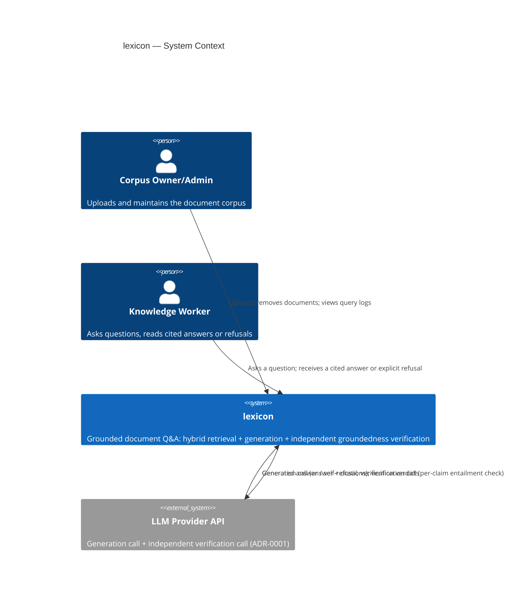
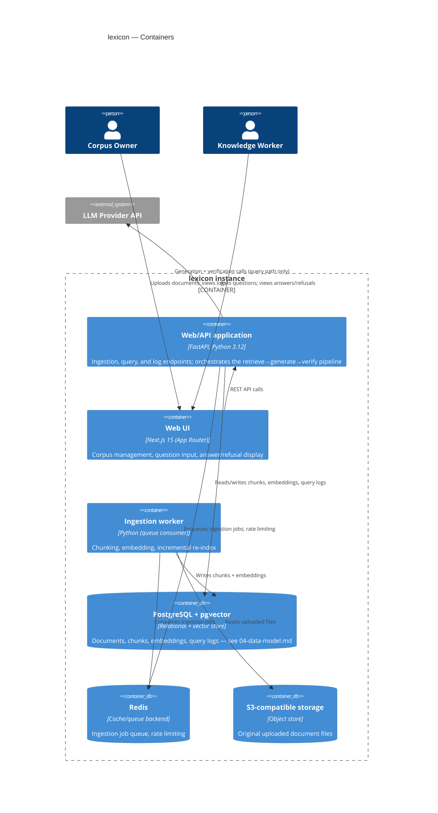
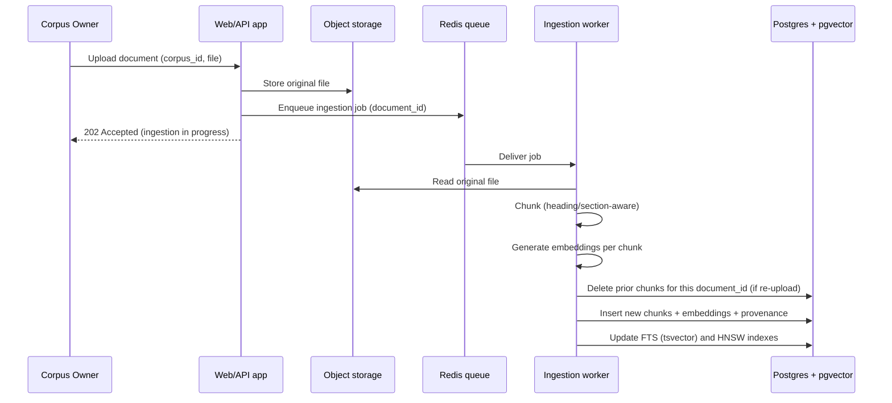
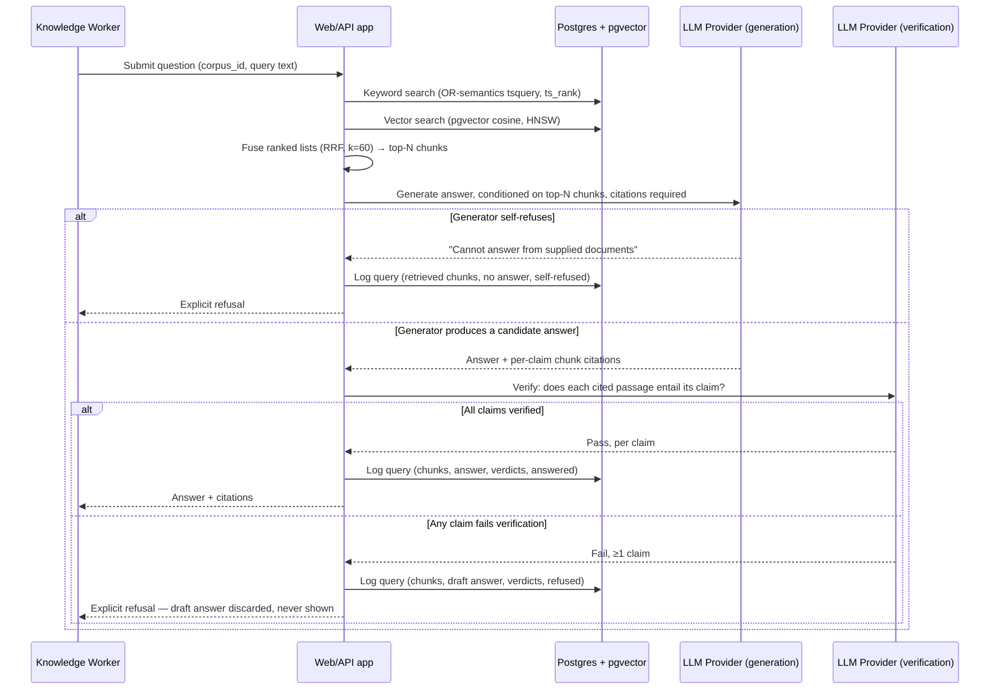

# Architecture
> Purpose: how the system is structured and why
> Project: lexicon (public)
> Last updated: 2026-08-27

## System context diagram

## Container/component diagram

## Component responsibilities and boundaries

| Component | Responsibility | Explicitly not responsible for |
|---|---|---|
| Web/API application | Request handling; orchestrates the query pipeline (retrieve → generate → verify → decide); enforces single-corpus isolation (FR-014); writes query log entries | Long-running ingestion work (chunking/embedding a full document) — always handed to the ingestion worker so a large upload never blocks the request/response cycle |
| Web UI | Corpus selection, document upload UI, question input, answer/citation/refusal display, query log view | Any retrieval, generation, or verification logic — it calls the API and renders what the API decided, never makes its own groundedness judgment |
| Ingestion worker | Chunking (heading/section-aware), embedding generation, keyword-index and vector-index writes, incremental re-index on document change (FR-004) | Making the AND/OR keyword-query-semantics decision at query time — it only builds the index; OR-semantics query construction (FR-005) lives in the web/API application's retrieval code, exercised at every query, not baked into the index itself |
| PostgreSQL + pgvector | System of record for documents, chunks, embeddings, and query logs; serves both full-text search (GIN index, `tsvector`) and vector search (HNSW index, cosine distance) — the same infra the spike validated | Storing original uploaded files — those live in object storage; the database holds derived, chunked, indexed data, not source binaries |
| Redis | Ingestion job queue; per-corpus/per-operator query rate limiting (cost-control, NFR-007) | Durable storage of anything that must survive a cache flush — an ingestion job lost from the queue must be re-enqueueable from the source file in object storage, not irrecoverable |
| S3-compatible storage | Original uploaded document files, retained so re-chunking/re-embedding never requires re-uploading | Serving as the queryable store — chunks and embeddings for retrieval live in Postgres, not reconstructed from object storage per query |
| LLM Provider API (external) | Two distinct calls per answered query: (1) generation, conditioned on retrieved passages, producing cited claims or a self-refusal; (2) independent verification, checking each cited claim against its passage (ADR-0001) | Making the final answer/refuse decision unilaterally — the web/API application applies the gate ("all claims verified, or refuse") deterministically; the LLM produces judgments, the application enforces the invariant |

**The verification call (ADR-0001) is architecturally a second, independent
LLM call issued by the web/API application — never a second turn inside the
same conversation/context as the generation call, and never skippable for
an answer that will be shown to the user.** This boundary is the direct
implementation of ADR-0001's "verification is not trusted alone as
self-assessment" decision: if verification were folded into the same call
as generation, a model confidently wrong about its own answer would also be
confidently wrong about grading it, which is exactly the failure mode
Finding 2 demonstrated at the retrieval-similarity layer and which
ADR-0001 exists to avoid recreating at the generation layer.

## Key flows

### Ingestion (upload → queryable)

Re-upload and removal (FR-004) follow the same shape: the worker deletes
only the affected document's chunk rows (a `document_id`-scoped delete)
before inserting replacements, or deletes with no reinsertion for removal —
no other document in the corpus is touched, which is what makes the
"incremental re-indexing" claim in `01-scope-and-non-goals.md` real rather
than aspirational.

### Ask a question (the refusal-mechanism centerpiece)

This flow is the direct architectural expression of ADR-0001: refusal is
reachable from two independent points (generator self-refusal, and
verification failure), and an answer is only ever shown to the user after
passing through the second, independent check — the raw retrieval fusion
score never gates the answer/refuse decision directly, closing the gap
Finding 2 measured.

### Hybrid retrieval (fixed by Session 1's spike)

- **Keyword search:** Postgres full-text search using `to_tsquery` with
  query terms joined by `|` (OR), ranked by `ts_rank`, against a GIN index
  on a `tsvector` column. `plainto_tsquery` (AND semantics) must not appear
  anywhere in the retrieval path — spike Finding 1 measured this scoring
  0/9 (0%) recall@3, a correctness bug class, not a style preference (FR-005).
- **Vector search:** pgvector, HNSW index, cosine distance, matching the
  spike's proven infrastructure.
- **Fusion:** Reciprocal Rank Fusion (RRF, k=60, matching the spike) merges
  the two ranked lists into one; the top-N (implementation default: 5,
  bounding generation input tokens per NFR-005's latency budget and
  NFR-007's cost-control goal) are passed to generation.
- This is unchanged from the spike's proven design — Session 1 already
  validated it end-to-end against real infrastructure; this session fixes
  it as the production shape rather than re-deriving it.

## Scalability approach

- Ingestion is already decoupled from the request/response cycle (queue +
  worker), so ingesting large documents does not block the API — this
  matters more as corpus size grows toward the 500+ chunk/20+ document
  target named in `00-project-brief.md`'s success metric #1.
- The query path's cost driver is the two LLM calls (generation +
  verification), not the retrieval step — pgvector HNSW and Postgres FTS
  are both designed for sub-second lookups at the corpus scales this
  product targets (bounded, organisation-owned corpora, not
  web-scale — `01-scope-and-non-goals.md` explicitly excludes
  retrieval-quality guarantees "on unbounded/very-large corpora"). Scaling
  effort belongs on the LLM-call side (see Cost-control below), not on the
  retrieval indexes.
- Multiple ingestion workers can run concurrently against the same queue
  without coordination beyond the existing per-document row locking in
  Postgres, since each ingestion job is scoped to one document.

## Failure handling and degradation modes

- **Ingestion worker failure mid-job:** the job is re-enqueueable from the
  original file in object storage (worker never deletes the source file);
  a partially-written chunk set for a document must not be left queryable —
  the chunk insert for a document is a single transaction, so a crash
  either leaves the prior chunks in place (re-upload not yet applied) or
  the new ones fully applied, never a mix.
- **LLM provider unavailable or errors during generation:** the query fails
  closed — the system returns an explicit "unable to process this question
  right now" error, never a silent fallback to an unverified or
  similarity-only answer. This is a direct consequence of ADR-0001: there
  is no degraded mode that bypasses verification, because a bypassed
  verification step is exactly the unsafe behavior Finding 2 measured.
- **LLM provider unavailable or errors during verification (generation
  already succeeded):** same fail-closed rule — a generated-but-unverified
  answer is never shown. The draft answer is discarded and the query is
  logged as failed/refused, not silently retried into a lower-scrutiny path.
- **Retrieval returns zero candidates (empty corpus or no fusion matches):**
  short-circuits directly to refusal without invoking generation at all —
  there is nothing to generate from, so no LLM cost is spent on a query the
  system already knows it cannot answer.

## Backup and recovery design (RPO / RTO)

- **PostgreSQL (documents, chunks, embeddings, query logs):** the system of
  record. RPO/RTO targets are deferred to `08-deployment-and-operations.md`
  as a deployment-configuration concern (matching this repo's "Operations
  intentionally light" stance, `docs/SDLC-EVIDENCE.md`) — not invented here
  without a concrete backup mechanism chosen yet.
- **Object storage (original files):** recoverable independently of
  Postgres; since chunks/embeddings can be regenerated from the original
  file (deterministic chunking + embedding, given the same model), object
  storage backup is the higher-priority target — losing it means a document
  cannot be re-ingested even if the original chunks in Postgres are intact
  and stale.
- **Query logs:** their retention/backup policy follows the operator
  configuration named in `02-requirements.md`'s Data classification table,
  not a fixed value asserted here.

## Technology choices (links to ADRs)

- **Refusal mechanism: post-generation groundedness/entailment
  verification, not retrieval-similarity thresholding** —
  [`docs/adr/ADR-0001-groundedness-refusal-check.md`](../adr/ADR-0001-groundedness-refusal-check.md).
  This is the centerpiece decision of this session; every other choice on
  this page (the two-call query flow, the fail-closed error handling, the
  cost-control approach below) is downstream of it.
- **Hybrid retrieval (OR-semantics keyword + vector, RRF fusion), not
  vector-only or keyword-only** — reasoned and measured in
  `00b-rag-vs-alternatives.md` and the Session 1 spike; this document fixes
  it as the production design rather than re-deciding it.
- **LLM provider and cost-control approach** (below) is a real decision
  made this session, with one open item explicitly flagged rather than
  discovered mid-build.

### LLM provider choice

**Decision: Anthropic Claude API**, for two reasons specific to this
project rather than by default: (1) native prompt caching support directly
reduces the repeated-context cost this pipeline incurs (the same retrieved
passages are sent to both the generation and verification calls — caching
the passage content between those two calls, and across repeated queries
against similar chunks, is a direct, quantifiable cost lever, not a vague
"maybe it helps" hope); (2) it gives access to genuinely different model
tiers (currently, as of this session's date: Opus, Sonnet, Haiku-class
models) suited to this pipeline's two structurally different tasks —
open-ended grounded generation versus a narrow, bounded per-claim
entailment classification.

**Model-tier assignment, matching each call's actual task shape:**
- **Generation call:** a mid/high-tier model (Sonnet-class) — grounded
  answer synthesis with citation attribution is an open-ended generation
  task that benefits from a stronger model, and it runs once per query
  regardless of outcome.
- **Verification call:** a smaller/faster-tier model (Haiku-class) — the
  task is narrow and repeatable ("does this exact passage text entail this
  exact claim, yes/no, per claim"), which does not need frontier-model
  reasoning depth to do reliably and is exactly the kind of bounded
  classification task a cheaper tier is suited for. This asymmetry is the
  main lever that keeps ADR-0001's "two calls instead of one" trade-off
  from doubling cost outright — the second call is materially cheaper than
  the first, not equal to it.

**Specific model IDs are deliberately not pinned in this document** — model
releases move faster than this document's revision cadence, and pinning a
specific ID here would go stale before Session 4 (Implementation) actually
wires up the provider. The tier assignment above (generation:
mid/high-tier, verification: small/fast-tier) is the architectural
commitment; the exact model string is a Session 4 configuration decision,
made against whatever the current lineup is at that time.

### Cost-control approach

Real design decisions made now, because "every query costs real money
against an LLM API" is a standing constraint, not a later optimization:

- **Model-tier asymmetry** (above) — the more expensive call runs once per
  query; the cheaper call runs the bounded, repeatable check.
- **Skip verification when generation self-refuses** — already reflected in
  the Key flows diagram; there is nothing to verify when the generator
  produces no claims.
- **Bounded top-N chunks passed to generation** (implementation default 5,
  tunable) — bounds input token cost per query regardless of corpus size.
- **Prompt caching** for retrieved passage content shared between the
  generation and verification calls, and across queries that happen to
  retrieve overlapping chunks — a direct cost lever specific to choosing a
  provider with native cache support.
- **Per-corpus/per-operator query rate limiting** (Redis-backed, NFR-007) —
  bounds worst-case runaway spend from misuse or a runaway client, matching
  the self-hosted operator's need to cap their own exposure, the same
  reasoning `privacy-forge`'s NFR-006 rate limit applied to DSAR submission
  for a different resource-exhaustion concern.
- **No numeric cost budget is fixed in this document** (see
  `02-requirements.md` NFR-007) — a real dollar figure requires real
  pricing, which requires the open item below to be resolved first.

### Open item: LLM API credentials do not exist in this environment

**Stated plainly now, per this session's explicit ground rule, rather than
being discovered mid-build the way Stripe credentials were discovered
mid-build in a prior portfolio project:** this development environment has
no Anthropic API key or any other LLM provider credential configured (
checked directly — no `ANTHROPIC_API_KEY` or equivalent is present). This
means:

- No part of the generation or verification pipeline can be executed for
  real until an API key is provisioned. Session 4 (Implementation) cannot
  begin the query-path work without first resolving this.
- This is **not** a blocker for this session (Requirements & Architecture
  requires no live API calls — the design above is provider-agnostic at the
  interface level even though it names a specific provider) or for Session
  3 if a security/threat-model session runs before implementation.
- **Action needed before Session 4 starts:** provision an Anthropic API key
  (or, if a policy reason prevents that, revisit the provider choice above
  explicitly, not silently) and record how it is supplied to the
  application (env var via `docker-compose.yml`'s existing
  `${VAR:-default}` pattern, matching how `DATABASE_URL`/`REDIS_URL` are
  already wired) in `08-deployment-and-operations.md`.
- Recorded here, in the architecture doc itself and in the session
  handoff, specifically so it cannot resurface as a surprise blocker
  partway through Session 4 the way it reportedly did in `bookslot`.
