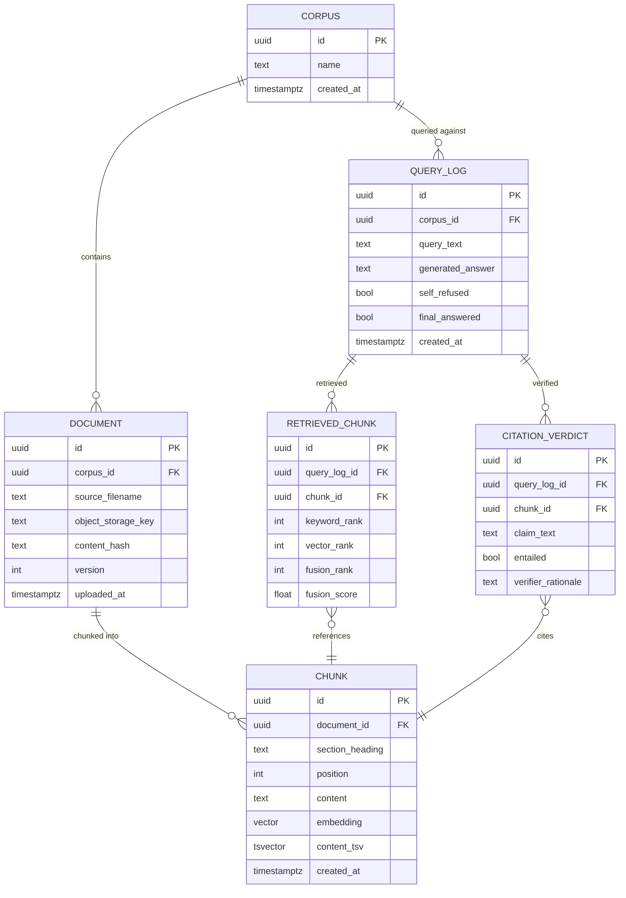

# Data Model
> Purpose: the authoritative description of stored data
> Project: lexicon (public)
> Last updated: 2026-08-27

## ERD

## Entity descriptions

| Entity | Purpose | Key attributes | Classification |
|---|---|---|---|
| `CORPUS` | The bounded, named document set a set of queries is scoped to (FR-014 isolation boundary) | `name` | Not personal data itself; a container |
| `DOCUMENT` | One uploaded source file and its provenance | `source_filename`, `object_storage_key` (pointer to the original file), `content_hash` (detects no-op re-uploads), `version` (incremented on re-upload) | Confidential — see `02-requirements.md` Data classification |
| `CHUNK` | One heading/section-scoped passage of a document, the unit both retrieval and citation operate on | `section_heading`, `position`, `content` (chunk text), `embedding` (pgvector column), `content_tsv` (generated `tsvector` column for FTS) | Confidential — same classification as its parent document |
| `QUERY_LOG` | One end-to-end query: what was asked, what was generated, and the final decision (US-005, FR-011) | `query_text`, `generated_answer` (nullable — absent on self-refusal), `self_refused`, `final_answered` (the enforced gate outcome — true only if `self_refused = false` AND every `CITATION_VERDICT` for this query has `entailed = true`) | Confidential, audit-critical |
| `RETRIEVED_CHUNK` | One chunk retrieved for one query, with its rank in each signal and the fused result — the retrieval half of the audit trail | `keyword_rank`, `vector_rank`, `fusion_rank`, `fusion_score` (nullable per-signal ranks — a chunk retrieved by only one of keyword/vector has a null rank on the other) | Confidential, audit-critical |
| `CITATION_VERDICT` | One claim-to-passage entailment judgment from the independent verification step (ADR-0001) — the verification half of the audit trail | `claim_text` (the specific generated claim being checked), `entailed` (the gate value FR-009 reads), `verifier_rationale` (free text, for human review of disputed answers, US-005) | Confidential, audit-critical |

## Invariants and where they are enforced

- **A `CHUNK` always belongs to exactly one `DOCUMENT`, which belongs to
  exactly one `CORPUS`** — enforced by `NOT NULL` foreign keys with
  `ON DELETE CASCADE` from `CORPUS` → `DOCUMENT` → `CHUNK`, so corpus
  deletion cannot leave orphaned chunks retrievable (a direct implementation
  of FR-014's isolation requirement).
- **Re-upload/removal only touches the affected document's chunks (FR-004).**
  Enforced at the application layer (ingestion worker) as a single
  transaction per document: `DELETE FROM chunk WHERE document_id = :id`
  followed by the new inserts, or delete-only for removal — never a
  corpus-scoped delete. No other document's `CHUNK` rows are touched by
  this transaction, by construction (the `WHERE` clause is always
  `document_id`-scoped, never `corpus_id`-scoped).
- **`QUERY_LOG.final_answered = true` requires `self_refused = false` AND
  every associated `CITATION_VERDICT.entailed = true`.** This is the data-
  layer expression of ADR-0001's refusal gate. It is enforced at the
  application layer (the web/API application computes and writes
  `final_answered` only after all verification calls for a query return),
  not by a database constraint, because the verification step is
  inherently a multi-call, asynchronous-within-a-request process — a
  `CHECK` constraint cannot see LLM call results. This is recorded as a
  known enforcement boundary: a bug in the application-layer gate logic is
  the single point of failure for the entire "cited or refused" invariant,
  which is exactly why FR-009/US-004's acceptance criteria are written as
  explicit, directly testable feature-test assertions, not left to be
  "probably fine because the schema implies it."
- **`RETRIEVED_CHUNK` and `CITATION_VERDICT` are append-only** with respect
  to a given `QUERY_LOG` — no update path exists; a query's audit trail is
  written once, at the time the query was processed, matching the
  accountability purpose of US-005 (a log that could be edited after the
  fact would not be trustworthy evidence, the same reasoning
  `privacy-forge`'s ADR-0003 applied to its audit log, though this project
  does not hash-chain — see Revisit below).

## Indexing strategy

- **`CHUNK.content_tsv`**: GIN index, generated `tsvector` column, queried
  via OR-joined `to_tsquery` (never `plainto_tsquery` — FR-005). This
  matches the spike's proven keyword-search configuration exactly.
- **`CHUNK.embedding`**: HNSW index (pgvector), cosine distance — matches
  the spike's proven vector-search configuration exactly.
- **`CHUNK.document_id`**: B-tree index — supports the document-scoped
  delete that makes incremental re-indexing (FR-004) an efficient,
  targeted operation rather than a full-table scan.
- **`QUERY_LOG.corpus_id`, `created_at`**: composite B-tree index — supports
  the corpus owner's query-log view (FR-012) filtered and ordered by
  recency without a full scan as log volume grows.
- **`RETRIEVED_CHUNK.query_log_id`, `CITATION_VERDICT.query_log_id`**:
  B-tree indexes — supports assembling one query's full audit trail (US-005)
  in a single indexed lookup per table.

## Migration approach and rollback

- Standard Alembic migrations (already the project's chosen migration
  tooling per `00a-ledger-confirmation.md`'s ledger row) — additive,
  reversible migrations for each entity introduced above; no data
  migration is needed yet since no application tables exist beyond the
  Session 0 health-check skeleton.
- `pgvector`'s extension (`CREATE EXTENSION vector`) and the HNSW index
  type must be created before the `CHUNK.embedding` column migration —
  ordering dependency to record explicitly in the first Alembic revision
  that touches `CHUNK`, since a HNSW index migration will fail silently
  informative (a clear Postgres error, not silent data loss) if the
  extension isn't present, but should not be left to be discovered at
  migration time.
- Rollback for the schema itself follows standard Alembic downgrade paths;
  rollback of in-flight ingestion jobs is handled by the queue's own
  redelivery (Redis) rather than a database transaction spanning the
  chunking/embedding process, since embedding generation is an external
  call (to the embedding model/provider), not a database operation that
  can be wrapped in the same transaction as the writes.

## Retention and deletion rules

- **`DOCUMENT`/`CHUNK`**: deleted immediately on corpus-owner-initiated
  removal (FR-004); no soft-delete/grace-period is specified by this
  document — an operator-configurable grace period, if wanted, is a
  Session 4+ implementation detail, not assumed here.
- **`QUERY_LOG`/`RETRIEVED_CHUNK`/`CITATION_VERDICT`**: retention is
  operator-configured (per `02-requirements.md`'s Data classification
  table) — no fixed retention period is invented here. Deletion of a
  `QUERY_LOG` row cascades to its `RETRIEVED_CHUNK` and `CITATION_VERDICT`
  rows (foreign key `ON DELETE CASCADE`), so partial audit-trail deletion
  (keeping the query but losing its verification verdicts, or vice versa)
  cannot happen.
- **Original files in object storage**: deleted alongside their `DOCUMENT`
  row's removal — the pointer (`object_storage_key`) and the object itself
  are deleted together, application-layer orchestrated (object storage has
  no foreign-key awareness of Postgres), to avoid either an orphaned file
  with no corresponding row or a dangling row pointing at a deleted file.

## Revisit trigger

- `privacy-forge`'s audit log is hash-chained for tamper-evidence
  (ADR-0003) because its threat model includes an internal actor covering
  up a compliance violation. `lexicon`'s `QUERY_LOG`/`CITATION_VERDICT`
  trail is append-only at the application layer but **not** hash-chained in
  this design — this is a deliberate scope difference, not an oversight:
  `lexicon`'s threat model (`06-security-threat-model.md`, not yet written)
  has not yet established that tamper-evidence of the audit trail itself is
  a required control here, versus append-only-by-convention being
  sufficient for this product's accountability purpose. If the upcoming
  security/threat-model work concludes otherwise, this section should be
  revisited against that finding, not assumed settled by this document.
